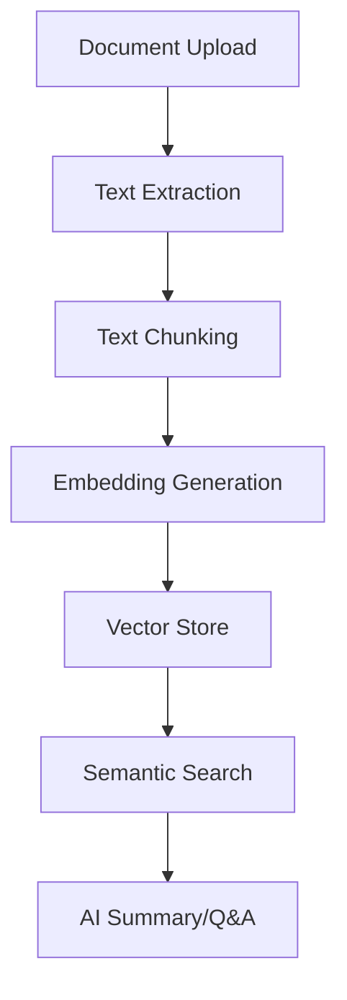

<div align="center">

# � DocIQ
### *Intelligent Document Analysis Platform*

*Transform any document into actionable insights with AI-powered summarization and Q&A capabilities*

[](https://python.org)
[](https://streamlit.io)
[](LICENSE)
[](https://github.com/Esataydin)

</div>

---

## 🎯 **What is DocIQ?**

DocIQ is a **privacy-first, locally-hosted** document intelligence platform that leverages state-of-the-art AI models to extract, analyze, and summarize content from your documents. Built with Streamlit, it provides an intuitive interface for document processing without compromising your data privacy.

### ⚡ **Key Highlights**
- 🔒 **100% Local Processing** - Your documents never leave your machine
- 🎭 **Role-Based Intelligence** - Tailored summaries for different audiences
- 💬 **Smart Q&A System** - Natural language document interrogation
- ⚡ **Lightning Fast** - Powered by FAISS vector search
- 📊 **Structured Output** - Clean summaries with actionable insights

---

## 🎪 **Features & Capabilities**

<table>
<tr>
<td width="50%">

### 📌 **Role-Based Summarization**
Generate intelligent summaries tailored for:
- **👔 CEO**: Business impact & strategic insights
- **⚙️ Engineer**: Technical specs & architecture
- **⚖️ Legal Analyst**: Compliance & risk analysis
- **📊 General**: Balanced overview

</td>
<td width="50%">

### 🔍 **Intelligent Q&A System**
- Ask natural language questions
- Semantic search with `bge-large-en`
- Context-aware answers with confidence scores
- Export Q&A sessions for reference

</td>
</tr>
</table>

### 🧾 **Export & Download**
- Download summaries as formatted text files
- Export complete Q&A sessions
- Role-specific summary exports

---

## 🏗️ **Architecture & Tech Stack**



### 🛠️ **Core Technologies**

| Component | Technology | Purpose |
|-----------|------------|---------|
| **Frontend** | Streamlit | Interactive web interface |
| **Text Processing** | PyMuPDF | PDF text extraction |
| **Embeddings** | SentenceTransformers (`BAAI/bge-large-en`) | Semantic understanding |
| **Vector DB** | FAISS | Fast similarity search |
| **Summarization** | Transformers (`google/pegasus-xsum`) | Content summarization |
| **Q&A Engine** | Transformers (`deepset/roberta-base-squad2`) | Question answering |

---

## 🚀 **Quick Start Guide**

### **Prerequisites**
- Python 3.8 or higher
- 4GB+ RAM (for AI models)
- Windows/macOS/Linux

### **Installation**

1. **Clone the repository**
   ```bash
   git clone https://github.com/Esataydin/Smart-Document-Summarizer.git
   cd Smart-Document-Summarizer
   ```

2. **Set up virtual environment** *(recommended)*
   ```bash
   # Create environment
   python -m venv dociq-env
   
   # Activate environment
   # Windows:
   dociq-env\Scripts\activate
   # macOS/Linux:
   source dociq-env/bin/activate
   ```

3. **Install dependencies**
   ```bash
   pip install -r requirements.txt
   ```

4. **Launch DocIQ**
   ```bash
   streamlit run main.py
   ```

5. **Open your browser** and navigate to `http://localhost:8501`

### **🎯 Quick Demo**
1. Upload the included `test.pdf` file
2. Select a role (try "CEO" for business insights)
3. Generate summary and explore Q&A features

---

## � **Project Structure**

```
📦 Smart-Document-Summarizer/
├── 🚀 main.py                 # Main Streamlit application
├── 📋 requirements.txt        # Python dependencies
├── 📖 README.md              # Project documentation
├── 🔧 .env                   # Environment variables
├── 📄 test.pdf               # Sample PDF for testing
├── � test.txt               # Sample text file
└── 📁 venv/                  # Virtual environment
```

---

## 🧠 **How DocIQ Works**

### **1. Document Processing Pipeline**
```
PDF Upload → Text Extraction → Intelligent Chunking → Embedding Generation
```

### **2. AI-Powered Analysis**
```
User Query → Semantic Search → Context Retrieval → AI Response Generation
```

### **3. Role-Based Intelligence**
DocIQ uses specialized prompts for different user roles:

| Role | Focus Areas |
|------|-------------|
| **General** | Clear, balanced overview |
| **CEO** | Business value, ROI, strategic implications |
| **Engineer** | Technical details, architecture, performance |
| **Legal Analyst** | Compliance, risks, obligations, dates |

---

## 🔧 **Configuration & Customization**

### **Environment Variables**
Create a `.env` file for custom configurations:
```env
CHUNK_SIZE=300
OVERLAP_SIZE=50
MAX_DOCUMENT_SIZE=15000
```

### **Model Customization**
You can modify the AI models in `main.py`:
```python
# Current models
embed_model = SentenceTransformer('BAAI/bge-large-en')
summarizer = pipeline("summarization", model="google/pegasus-xsum")
qa_model = pipeline("question-answering", model="deepset/roberta-base-squad2")
```

---

## 🎮 **Usage Examples**

### **Business Intelligence**
```
Role: CEO
Document: Annual Report
Result: Strategic insights, financial highlights, growth opportunities
```

### **Technical Analysis**
```
Role: Engineer
Document: System Architecture Doc
Result: Performance metrics, technical specifications, implementation details
```

### **Compliance Review**
```
Role: Legal Analyst
Document: Contract Agreement
Result: Key obligations, important dates, compliance requirements
```

---

## 🚦 **Performance & Limitations**

### **✅ Optimal Performance**
- Document size: 5-10 pages
- File formats: PDF (best support)
- Languages: English (primary)

### **⚠️ Current Limitations**
- Large documents may have performance issues
- Limited to PDF format (TXT support in development)
- Requires local GPU for optimal performance

---

## 🛣️ **Roadmap & Future Enhancements**

- [ ] **Multi-format Support**: Word, PowerPoint, Excel
- [ ] **Multi-language Processing**: Support for 50+ languages
- [ ] **Advanced Analytics**: Sentiment analysis, key metrics extraction
- [ ] **Cloud Deployment**: Optional cloud hosting
- [ ] **API Integration**: RESTful API for programmatic access
- [ ] **Collaborative Features**: Team workspaces and sharing

---

## 🤝 **Contributing**

We welcome contributions! Here's how you can help:

1. **🐛 Report Issues**: Found a bug? [Open an issue](https://github.com/Esataydin/Smart-Document-Summarizer/issues)
2. **💡 Feature Requests**: Have an idea? [Start a discussion](https://github.com/Esataydin/Smart-Document-Summarizer/discussions)
3. **🔧 Code Contributions**: Submit pull requests with improvements
4. **📖 Documentation**: Help improve documentation and examples

### **Development Setup**
```bash
# Fork the repo, then:
git clone https://github.com/yourusername/Smart-Document-Summarizer.git
cd Smart-Document-Summarizer
pip install -r requirements.txt
# Make your changes and submit a PR!
```

---

## 📜 **License**

This project is licensed under the MIT License - see the [LICENSE](LICENSE) file for details.

---

## 🙏 **Acknowledgments**

### **Open Source Heroes**
- **[Hugging Face](https://huggingface.co/)** - Transformers and model hosting
- **[Sentence Transformers](https://www.sbert.net/)** - Semantic embeddings
- **[FAISS](https://github.com/facebookresearch/faiss)** - Vector similarity search
- **[Streamlit](https://streamlit.io/)** - Web app framework
- **[PyMuPDF](https://pymupdf.readthedocs.io/)** - PDF processing

---

<div align="center">

### 💬 **Questions? Feedback?**

**We'd love to hear from you!**

[🐛 Issues](https://github.com/Esataydin/Smart-Document-Summarizer/issues) • [💡 Discussions](https://github.com/Esataydin/Smart-Document-Summarizer/discussions)

---

*Built by [Esataydin](https://github.com/Esataydin)*

**⭐ Star this repo if DocIQ helped you!**

</div>
